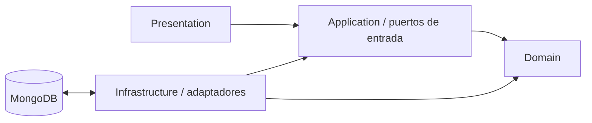

# Capas hexagonales

```mermaid
flowchart LR
    P["Presentation"] --> A["Application / puertos de entrada"]
    A --> D["Domain"]
    I["Infrastructure / adaptadores"] --> A
    I --> D
    DB[("MongoDB")] <--> I
```

Las flechas representan dependencia de código hacia el núcleo; no necesariamente flujo de ejecución.
