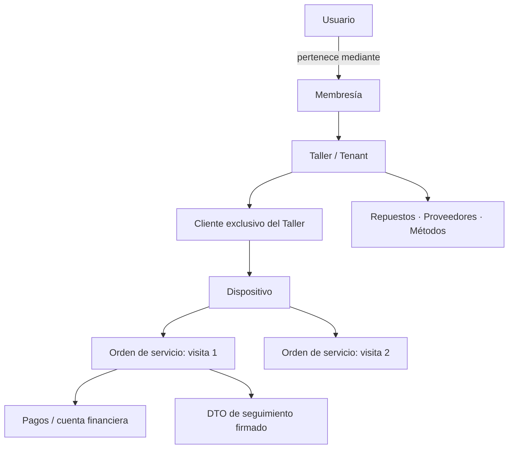

# Contexto y tenancy

```mermaid
flowchart TD
    U["Usuario"] -->|"pertenece mediante"| M["Membresía"]
    M --> T["Taller / Tenant"]
    T --> C["Cliente exclusivo del Taller"]
    C --> D["Dispositivo"]
    D --> O1["Orden de servicio: visita 1"]
    D --> O2["Orden de servicio: visita 2"]
    T --> R["Repuestos · Proveedores · Métodos"]
    O1 --> P["Pagos / cuenta financiera"]
    O1 --> S["DTO de seguimiento firmado"]
```

Las cardinalidades múltiples Usuario–Taller y Dispositivo–Orden están definidas en BR-002, BR-003 y BR-009. El diagrama no define almacenamiento.
