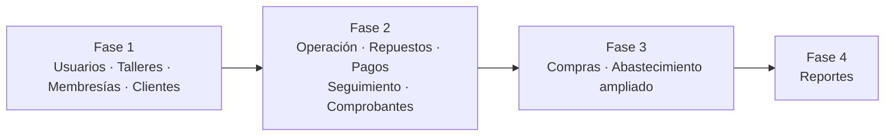

# Roadmap modular

```mermaid
flowchart LR
    F1["Fase 1<br/>Usuarios · Talleres · Membresías · Clientes"] --> F2["Fase 2<br/>Operación · Repuestos · Pagos<br/>Seguimiento · Comprobantes"]
    F2 --> F3["Fase 3<br/>Compras · Abastecimiento ampliado"]
    F3 --> F4["Fase 4<br/>Reportes"]
```

La flecha indica secuencia del roadmap, no dependencia técnica obligatoria entre todos los módulos.
